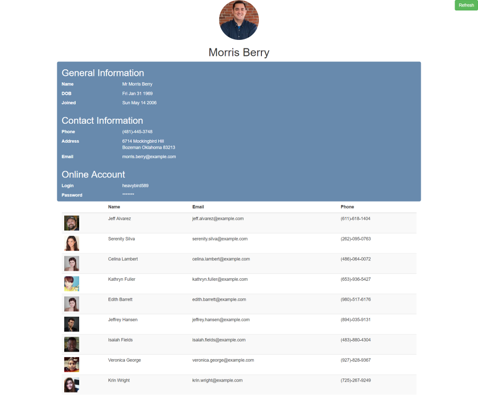
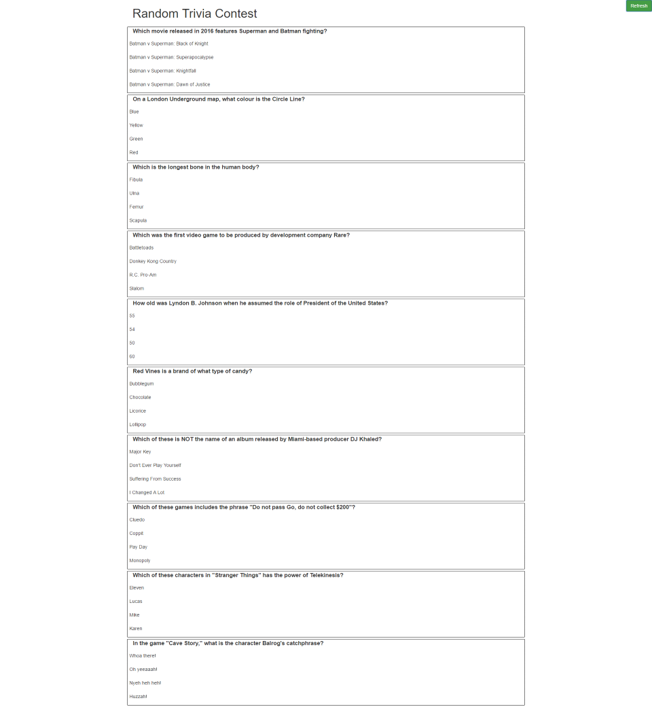
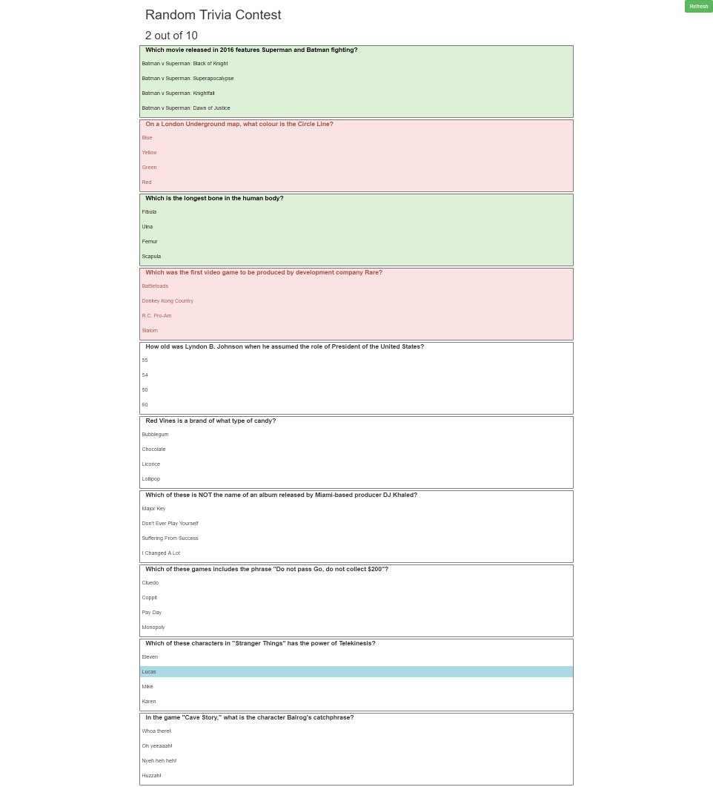

# JSON, AJAX, and External Web APIs

## Random User Generator

A web service exists to generate random user data every time it is called. [Link](https://randomuser.me/)

### **Calling the Random User service**

You can use AJAX to call the Random User API to receive a randomly generated user in return.

```
$.ajax({
  url: 'https://randomuser.me/api/',
  dataType: 'json',
  success: function(data) {
    console.log(data);
  }
});
```

You will be developing a page that relies on the Random User Service to return a list of 10 profiles. The first profile will be prominently displayed at the top of the page 
while the remaining 9 are displayed in a table below it.

[Documentation](https://randomuser.me/documentation) exists demonstrating how to retrieve more than one record or apply additional filter criteria (e.g. nationality). 

### **Building the Page**

The Boostrap Framework was used to develop the below page sample. 

* When the page loads, it fetches profile data for ten users from the Random User API.
* The user can also click the button in the upper right hand corner to refresh the profile data for ten users.

The first profile result is displayed in the center of the page. The remaining 9 profiles are used to build the table below. 


 


## Random Trivia Quiz

An api exists at [The Open Trivia Database](https://opentdb.com/) to generate random trivia questions and answers.

Use it to build a simple web page that displays the questions and answers.



**BONUS** Leverage your skills with event handling and build the page so that it behaves like a real quiz.

- If the user clicks on a correct answer the box turns **GREEN**.
- If the user clicks on an incorrect answer the box turns **RED**.
- When a user gets a question right, update the score at the top with the total number of correct answers.




### **Calling the Random Trivia Database**

You can use the jQuery library to call the Random Trivia Database service to receive randomly generated questions and answers.

**Note** You can leave category, difficulty, and any-type blank. 

```
$.ajax({
  url: 'https://www.opentdb.com/api.php?amount={number}&category={category}&difficulty={difficulty-level}&type={any-type}',
  dataType: 'json',
  success: function(data) {
    console.log(data);
  }
});
```

**Note** You may need to insert https://cors-anywhere.herokuapp.com at the beginning of the URL

The response that comes back is structured following the format below

```
{
  "response_code": 0,
  "results": [
    {
      "category": "Entertainment: Video Games",
      "type": "multiple",
      "difficulty": "easy",
      "question": "In the game Half-Life, which enemy is showcased as the final boss?",
      "correct_answer": "The Nihilanth",
      "incorrect_answers": [
        "Dr. Wallace Breen",
        "G-Man",
        "The Gonarch"
      ]
    },
    {
      "category": "General Knowledge",
      "type": "multiple",
      "difficulty": "medium",
      "question": "Which of the following Ivy League universities has its official motto in Hebrew as well as in Latin?",
      "correct_answer": "Yale University",
      "incorrect_answers": [
        "Princeton University",
        "Harvard University",
        "Columbia University"
      ]
    }
  ]
}
```


#### **Supported Parameters**

| Category Id | Category |
|-------------|----------|
|    | any |
| 9  | General Knowledge |
| 10 | Entertainment: Books|
| 11 | Entertainment: Film|
| 12 | Entertainment: Music|
| 13 | Entertainment: Musicals & Theatres|
| 14 | Entertainment: Television|
| 15 | Entertainment: Video Games|
| 16 | Entertainment: Board Games|
| 17 | Science & Nature|
| 18 | Science: Computers|
| 19 | Science: Mathematics|
| 20 | Mythology|
| 21 | Sports|
| 22 | Geography|
| 23 | History|
| 24 | Politics|
| 25 | Art|
| 26 | Celebrities|
| 27 | Animals|
| 28 | Vehicles|
| 29 | Entertainment: Comics|
| 30 | Science: Gadgets|
| 31 | Entertainment: Japanese Anime & Manga|
| 32 | Entertainment: Cartoon & Animations|

#### **Supported Difficulty Levels**
| Difficulty Levels | 
|-------------------|
| easy |
| medium | 
| hard |

#### **Supported Question Types**

| Question Type |
|---------------|
| multiple |
| boolean |


## Other Public APIs Listed on the Internet

Collective List of Public APIs https://github.com/toddmotto/public-apis